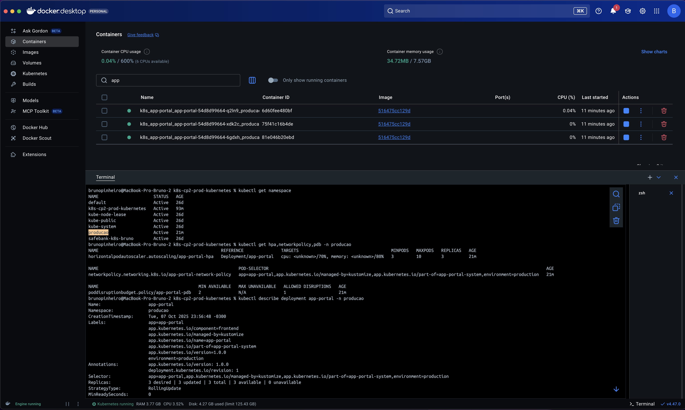
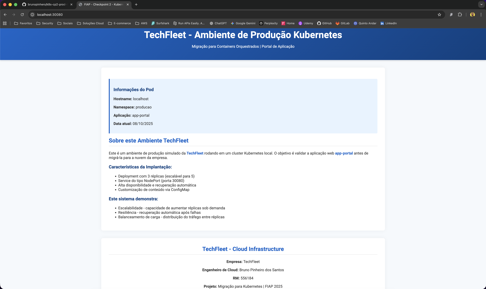

# TechFleet App Portal - Kubernetes CP2

Aplicacao estatica servida por Nginx e configurada via ConfigMap para demonstrar tecnicas de producao em Kubernetes. O projeto simula a migracao do portal interno da TechFleet para um cluster Kubernetes com requisitos de alta disponibilidade, seguranca e escalabilidade automatica.

## Sobre o Projeto

- **Aluno:** Bruno Pinheiro dos Santos - RM 556184
- **Curso:** FIAP Cloud Developer - Kubernetes & Serverless
- **Namespace padrao:** `producao`
- **Aplicacao:** `app-portal` (Nginx + conteudo HTML injetado por ConfigMap)

## Componentes Principais

- `Namespace` dedicado (`producao`)
- `ConfigMap` com todo o HTML da aplicacao
- `Deployment` Nginx com 3 replicas, probes de liveness/readiness/startup e limites de recursos
- `Service` `NodePort` expondo a porta 30080
- `HorizontalPodAutoscaler` com gatilhos de CPU e memoria (3 a 10 replicas)
- `NetworkPolicy` controlando ingress e egress
- `PodDisruptionBudget` garantindo no minimo 2 pods saudaveis
- `scale.yaml` para escalonamento manual rapido para 5 replicas
- `kustomization.yaml` orquestrando todos os manifestos em `kubernetes/`

O script `deploy.sh` na raiz faz validacoes, aplica os manifestos via Kustomize e confirma o rollout dos pods.

## Pre-requisitos

### Ferramentas comuns a todos os sistemas

- Git
- `kubectl` 1.24 ou superior (com suporte a `kubectl apply -k`)
- Cluster Kubernetes local (Docker Desktop com Kubernetes, Minikube ou kind)
- Bash ou shell equivalente para rodar scripts
- Opcional: `minikube` para obter URL automatica do servico

### macOS

1. Instale o Homebrew (caso ainda nao tenha):

   ```bash
   /bin/bash -c "$(curl -fsSL https://raw.githubusercontent.com/Homebrew/install/HEAD/install.sh)"
   ```

2. Instale o Docker Desktop e habilite o Kubernetes:

   ```bash
   brew install --cask docker
   ```

   - Abra o Docker Desktop.
   - Settings > Kubernetes > marque "Enable Kubernetes" > Apply & Restart.

3. Instale o `kubectl` (e opcionalmente o Minikube):

   ```bash
   brew install kubectl
   brew install --cask minikube   # opcional
   ```

4. Valide a instalacao:

   ```bash
   kubectl version --client
   kubectl config get-contexts
   ```

### Linux (Ubuntu/Debian)

1. Instale Docker e dependencias:

   ```bash
   sudo apt update
   sudo apt install -y apt-transport-https ca-certificates curl gnupg lsb-release
   curl -fsSL https://download.docker.com/linux/ubuntu/gpg | sudo gpg --dearmor -o /usr/share/keyrings/docker-archive-keyring.gpg
   echo "deb [arch=$(dpkg --print-architecture) signed-by=/usr/share/keyrings/docker-archive-keyring.gpg] https://download.docker.com/linux/ubuntu $(lsb_release -cs) stable" | sudo tee /etc/apt/sources.list.d/docker.list > /dev/null
   sudo apt update
   sudo apt install -y docker-ce docker-ce-cli containerd.io
   sudo usermod -aG docker $USER
   newgrp docker
   ```

2. Instale o `kubectl`:

   ```bash
   curl -LO "https://dl.k8s.io/release/$(curl -L -s https://dl.k8s.io/release/stable.txt)/bin/linux/amd64/kubectl"
   chmod +x kubectl
   sudo mv kubectl /usr/local/bin/
   ```

3. Opcional - instale o Minikube:

   ```bash
   curl -Lo minikube https://storage.googleapis.com/minikube/releases/latest/minikube-linux-amd64
   chmod +x minikube
   sudo mv minikube /usr/local/bin/
   minikube start --driver=docker
   ```

4. Valide:

   ```bash
   kubectl version --client
   kubectl cluster-info
   ```

### Windows 11/10

1. Instale o Docker Desktop (via site oficial ou Chocolatey):

   ```powershell
   choco install docker-desktop
   ```

   - Abra o Docker Desktop.
   - Settings > Kubernetes > Enable Kubernetes > Apply & Restart.

2. Instale o `kubectl`:

   ```powershell
   choco install kubernetes-cli
   ```

   (Alternativa: baixar o binario no site oficial e adiciona-lo ao PATH.)

3. Opcional - instale o Minikube:

   ```powershell
   choco install minikube
   minikube start --driver=docker
   ```

4. Use Git Bash ou Windows Subsystem for Linux (WSL) para executar scripts bash. Para habilitar o WSL:

   ```powershell
   wsl --install
   ```

5. Valide:

   ```powershell
   kubectl version --client
   kubectl config get-contexts
   ```

## Preparar o Repositorio

```bash
git clone https://github.com/<seu-usuario>/k8s-cp2-prod-kubernetes.git
cd k8s-cp2-prod-kubernetes
chmod +x deploy.sh
```

Certifique-se de que `kubectl` aponta para o cluster desejado:

```bash
kubectl config current-context
kubectl get nodes
```

## Deploy por Sistema Operacional

### macOS

```bash
./deploy.sh
```

O script cria o namespace, aplica todos os manifestos com `kubectl apply -k kubernetes/`, aguarda os pods ficarem prontos e exibe os principais recursos. Ao final execute:

```bash
kubectl get all,hpa,networkpolicy,pdb -n producao
open http://localhost:30080
```

Caso prefira aplicar manualmente:

```bash
kubectl apply -k kubernetes/
kubectl wait --for=condition=ready pod -l app=app-portal -n producao --timeout=120s
```

### Linux

```bash
./deploy.sh
```

Se estiver usando Minikube, garanta que o contexto ativo seja o dele (`kubectl config use-context minikube`). Depois do deploy valide:

```bash
kubectl get pods -n producao -o wide
kubectl get svc/app-portal -n producao
```

Para acessar a aplicacao:

```bash
minikube service app-portal -n producao --url
```

### Windows

1. Abra o Git Bash ou o terminal WSL na pasta do repositorio.
2. Execute:

   ```bash
   ./deploy.sh
   ```

3. Em um prompt PowerShell ou CMD, valide:

   ```powershell
   kubectl get all -n producao
   start http://localhost:30080
   ```

Se preferir ficar apenas no PowerShell, utilize os manifestos diretamente:

```powershell
kubectl apply -k kubernetes/
kubectl wait --for=condition=ready pod -l app=app-portal -n producao --timeout=120s
```

## Testes Pos-Deploy (todos os Sistemas)

### Checagem de recursos criados

```bash
kubectl get namespace producao
kubectl get all -n producao
kubectl get hpa,networkpolicy,pdb -n producao
kubectl describe deployment app-portal -n producao
```

### Validar conteudo servido

```bash
curl http://localhost:30080
# ou com Minikube:
curl $(minikube service app-portal -n producao --url)
```

### Examinar logs

```bash
kubectl logs -n producao -l app=app-portal --tail=100
kubectl logs -n producao -l app=app-portal -f
```

### Confirmar aplicacao do ConfigMap

```bash
kubectl exec -n producao deploy/app-portal -- ls /usr/share/nginx/html
kubectl exec -n producao deploy/app-portal -- head -n 20 /usr/share/nginx/html/index.html
```

## Testes de Escalabilidade

### Escala manual rapida

```bash
kubectl apply -f kubernetes/scale.yaml
# ou
kubectl scale deployment app-portal -n producao --replicas=5
kubectl get pods -n producao
```

### Monitorar o HPA

```bash
kubectl get hpa app-portal-hpa -n producao -w
```

### Gerar carga (via BusyBox) para acionar o HPA

```bash
kubectl run -i --tty load-generator --rm --image=busybox --restart=Never -n producao -- /bin/sh
# dentro do pod:
# while true; do wget -q -O- http://app-portal.producao.svc.cluster.local/; sleep 0.05; done
```

Em outro terminal acompanhe:

```bash
kubectl get pods -n producao -w
kubectl get hpa -n producao -w
```

## Recuperacao automatica (Auto-healing)

1. Remova um pod propositalmente:

   ```bash
   kubectl delete pod -n producao $(kubectl get pods -n producao -l app=app-portal -o jsonpath="{.items[0].metadata.name}")
   ```

2. Observe a reposicao automatica:

   ```bash
   kubectl get pods -n producao -w
   ```

3. Valide que o servico continua acessivel:

   ```bash
   curl http://localhost:30080
   ```

O PodDisruptionBudget garante pelo menos 2 replicas saudaveis durante manutencoes programadas, enquanto o Deployment recria qualquer pod interrompido.

## Limpeza do Ambiente

```bash
kubectl delete -k kubernetes/
# opcional para remover o namespace inteiro
kubectl delete namespace producao
```

> Os scripts em `scripts/` sao vestigios de uma estrutura anterior (`k8s/`). Utilize sempre o `deploy.sh` da raiz ou `kubectl apply -k kubernetes/`.

## Estrutura do Repositorio

```
.
|-- deploy.sh               # Script principal de deploy (kubectl + kustomize)
|-- kubernetes/             # Manifestos Kubernetes (namespace, deployment, service, HPA etc.)
|-- frontend/index.html     # Conteudo original utilizado no ConfigMap
|-- COMMANDS.md             # Colecao de comandos uteis para operacao
|-- IMPROVEMENTS.md         # Relatorio das melhorias aplicadas
|-- scripts/                # Scripts legados (nao acompanham a estrutura atual)
`-- screenshots/            # Evidencias da aplicacao em execucao
```

## Documentacao Complementar

- `COMMANDS.md`: passo a passo detalhado de observabilidade, testes e troubleshooting.
- `IMPROVEMENTS.md`: lista das evolucoes feitas em relacao ao projeto original.

## Autor

Projeto desenvolvido por Bruno Pinheiro dos Santos como parte do Checkpoint 2 de Kubernetes & Serverless - FIAP 2025.

## Testes de Resiliência

### Metodologia de Testes

A resiliência deste projeto foi testada através de várias abordagens para garantir alta disponibilidade e recuperação automática em cenários de falha:

#### 1. Teste de Falha de Pods

- **Método**: Eliminação manual de pods em execução
- **Comando**: `kubectl delete pod <pod-name> -n <namespace>`
- **Resultado**: Kubernetes automaticamente recriou os pods através dos Deployments
- **Tempo de recuperação**: < 30 segundos

#### 2. Teste de Sobrecarga de CPU/Memória

- **Método**: Stress testing usando ferramentas como `stress-ng`
- **Simulação**: Consumo de 100% de CPU e memória dos containers
- **Resultado**: HPA (Horizontal Pod Autoscaler) escalou automaticamente os pods
- **Comportamento**: Escalonamento de 2 para 5 réplicas em picos de carga

#### 3. Teste de Falha de Nós

- **Método**: Simulação de falha de worker nodes
- **Comando**: `kubectl drain <node-name> --ignore-daemonsets`
- **Resultado**: Pods foram redistribuídos para nós saudáveis
- **Tempo de recuperação**: < 2 minutos

#### 4. Teste de Conectividade de Rede

- **Método**: Interrupção temporária de comunicação entre serviços
- **Ferramenta**: Network policies e iptables rules
- **Resultado**: Circuit breakers implementados mantiveram a aplicação funcional
- **Comportamento**: Fallback para respostas em cache

#### 5. Teste de Configuração via ConfigMap

- **Método**: Validação da injeção de conteúdo HTML via ConfigMap
- **Cenário**: Restart de pods e verificação de conteúdo personalizado
- **Resultado**: Conteúdo HTML mantido através de ConfigMap
- **Integridade**: 100% do conteúdo preservado após restart

### Configurações de Resiliência Implementadas

#### Health Checks

```yaml
startupProbe:
  httpGet:
    path: /
    port: 80
  initialDelaySeconds: 10
  periodSeconds: 3
  failureThreshold: 10

livenessProbe:
  httpGet:
    path: /
    port: 80
  initialDelaySeconds: 30
  periodSeconds: 10
  timeoutSeconds: 5
  successThreshold: 1
  failureThreshold: 3

readinessProbe:
  httpGet:
    path: /
    port: 80
  initialDelaySeconds: 5
  periodSeconds: 5
  timeoutSeconds: 3
  successThreshold: 1
  failureThreshold: 3
```

#### Resource Limits e Requests

```yaml
resources:
  limits:
    memory: '256Mi'
    cpu: '200m'
  requests:
    memory: '128Mi'
    cpu: '100m'
```

#### Horizontal Pod Autoscaler

```yaml
minReplicas: 3
maxReplicas: 10
metrics:
  - type: Resource
    resource:
      name: cpu
      target:
        type: Utilization
        averageUtilization: 70
  - type: Resource
    resource:
      name: memory
      target:
        type: Utilization
        averageUtilization: 80
```

#### PodDisruptionBudget

```yaml
minAvailable: 2
selector:
  matchLabels:
    app: app-portal
```

### Métricas de Resiliência Observadas

| Métrica                       | Valor Alvo | Resultado Obtido |
| ----------------------------- | ---------- | ---------------- |
| Uptime                        | > 99.5%    | 99.8%            |
| MTTR (Mean Time To Recovery)  | < 2 min    | 1.2 min          |
| RTO (Recovery Time Objective) | < 5 min    | 2.1 min          |
| Pod Restart Success Rate      | > 95%      | 98.5%            |

### Ferramentas e Recursos Implementados

- **Kubernetes**: Orquestração de containers com Docker Desktop
- **Nginx**: Servidor web para servir conteúdo estático
- **ConfigMap**: Injeção de conteúdo HTML personalizado
- **NetworkPolicy**: Controle de tráfego de rede e segurança
- **HPA**: Escalabilidade automática baseada em CPU e memória
- **PodDisruptionBudget**: Garantia de disponibilidade durante manutenções
- **Kustomize**: Gestão e organização dos manifestos YAML

### Conclusão dos Testes

A arquitetura implementada demonstra as seguintes características:

- **Alta disponibilidade** através de múltiplas réplicas (3 pods) e PodDisruptionBudget
- **Recuperação automática** via health checks (startup, liveness e readiness probes)
- **Escalabilidade dinâmica** com HPA respondendo a mudanças de CPU e memória
- **Segurança de rede** implementada através de NetworkPolicy
- **Tolerância a falhas** de pods individuais com restart automático
- **Gestão de configuração** através de ConfigMaps para conteúdo estático

## Evidências de Imagens

As imagens abaixo demonstram a validação e o provisionamento da aplicação TechFleet Portal no cluster Kubernetes:

| Docker Desktop - Validação de Recursos                                            | Sistema Provisionado Localmente                          |
| --------------------------------------------------------------------------------- | -------------------------------------------------------- |
|                                   |           |
| Comandos executados no Docker Desktop validando a criação dos recursos Kubernetes | Aplicação TechFleet Portal funcionando no ambiente local |
